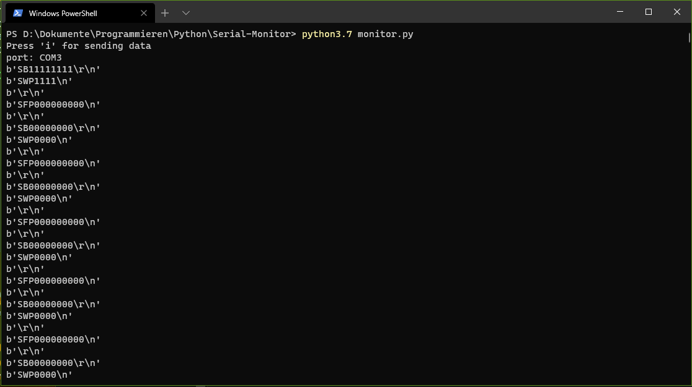

# Serial-Monitor

## Table of Contents
+ [About](#about)
+ [Getting Started](#getting_started)
+ [Usage](#usage)

## About <a name = "about" ></a>

A command-line serial monitor written in python developed to address a critical gap in arduino-cli, where the official project lacked a built-in serial monitor.</br></br>
This tool, fills this void by providing a convenient and platform-independent solution for monitoring and interacting with Arduino-based projects via the serial interface. With this command-line utility, developers can effortlessly establish serial connections to their Arduino boards, receive real-time data and send commands, all while enjoying the flexibility and extensibility that Python offers.</br></br> This project not only simplifies the debugging and testing process but also underscores the collaborative spirit of the open-source community in catering to the needs of Arduino enthusiasts worldwide.



## Getting Started <a name = "getting_started" ></a>

### Prerequisites
If needed install python and pip (methods may change based on the host OS).</br>
Then you can get the ___serial___ library with:
```bash
pip install pyserial
```

### Installing

clone the repo to your local machine:
```bash
git clone https://github.com/PBahner/Serial-Monitor.git
```

## Usage <a name = "usage" ></a>

Go to the project directory and start the serial monitor with:

```bash
python3 monitor.py
```

The program will check the system for serial ports to monitor and present you with a numbered list:

```bash
Detected serial device ports:

0 - /dev/ttyUSB0
1 - /dev/ttyUSB1

port (enter list number, s to skip):
```

At the prompt enter the number corresponding to the listed port you wish to monitor. You can skip this by entering 's' and enter a port manually.

You can also enter the port at runtime by passing the `--port` command line argument, e.g.:

```bash
python3 monitor.py --port "/dev/ttyUSB0"
```

Baudrate is defaulted to 9600. You can specify a different baudrate at runtime by passing the `--baudrate` command line argument, e.g.:

```bash
python3 monitor.py --port "/dev/ttyUSB0" --baudrate 19200
```

Now you will see incoming data. 
+ Press **i** to write data to the USB Device.
+ Press **q** to quit!

## Notes
This script is tested on **Linux** and on **Windows** .
